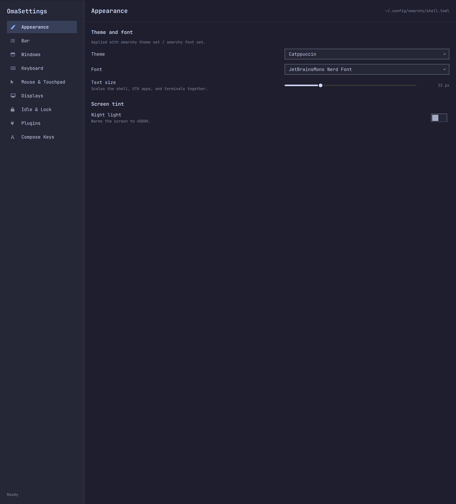

# OmaSettings

An Omarchy shell plugin: one window for the settings that otherwise live
scattered across `~/.config/omarchy/shell.json`, the Hyprland config in
`~/.config/hypr`, and `~/.XCompose`.

<p align="center"></p>

## Sections

| Section | What it covers | Where it lands |
|---|---|---|
| Appearance | Theme, font, text size, night light, background, boot screen, screensaver and about branding | `omarchy theme set` / `omarchy font set` / `omarchy display text size` / Omarchy menu Style |
| Bar | Position, transparency, centred widget | `~/.config/omarchy/shell.json` |
| Windows | Gaps, border, rounding, window opacity, dim, animations, blur | Hyprland |
| Keyboard | Layouts, variant, XKB options, repeat rate and delay, num lock | Hyprland |
| Keybindings | Every binding, searchable; add your own, turn Omarchy's off, put them back | `~/.config/hypr/bindings.lua` |
| Keyboard, Mouse & Touchpad | Also per device: one keyboard or pointer can depart from the global settings, via Hyprland's `hl.device` |  |
| Mouse & Touchpad | Sensitivity, acceleration, focus-follows-mouse, natural scroll, tap to click, two-finger right click, disable-while-typing, scroll speed | Hyprland |
| Displays | Per-monitor scale | Hyprland |
| Idle & Lock | Screensaver and lock timeouts, unlock animation | `~/.config/omarchy/shell.json` / Omarchy menu Style → Unlock |
| Plugins | Enable and disable installed shell plugins | `omarchy plugin enable/disable` |
| Compose Keys | Your `<Multi_key>` sequences: list, add, remove | `~/.XCompose` |
| Date & Time | Timezone and system time resync | Omarchy menu Update → Timezone / Time |
| Network | Wi-Fi networks, address and gateway, band, DNS resolver, Wi-Fi QR code | NetworkManager / `omarchy-network-band` / Omarchy menu Setup → Network |
| Audio | Output and input device, volume and mute for each | `pactl` |
| Power | Charge, time remaining, draw, health, and the power profile per power source | `upower` / `omarchy-powerprofiles-set` |
| Bluetooth | Adapter power, paired and nearby devices, connect, pair, forget | `omarchy-bluetooth-power` / `omarchy-bluetooth-device` |
| Applications → Defaults | Browser, terminal, editor, coding agent | Omarchy menu Setup → Defaults |
| Applications → Herdr | Herdr's appearance, panes, sidebar, behaviour, notifications and prefix key | `~/.config/herdr/config.toml` |
| Applications → Tmux | Prefix, copy-mode keys, status bar, window and pane numbering, mouse, scrollback, clipboard | `~/.config/tmux/tmux.conf` |
| Applications → Neovim | Gutter, wrapping, column guide, scrolloff, spell, indentation | `~/.config/nvim/lua/config/options.lua` |

The Style, Setup and Update sections are read from the Omarchy menu's own definition
(`omarchy-menu.jsonc`, defaults plus your extensions) rather than a second
list that can drift, so its entries and actions are exactly the menu's
Setup → Defaults → Agent and Update → Timezone / Time: picking an agent that
is not installed opens a terminal to set it up, the current one is marked with
the menu's own `checked` test, and the timezone button opens the same picker
the menu opens. The current timezone and clock are shown next to the buttons
so you can see what you are changing.

## How it writes

Two rules shape the whole plugin.

**Your config files are never rewritten.** Parsing and rewriting hand-written
Lua or conf is how a settings app eats someone's setup. Instead every Hyprland
change is applied live with `hyprctl keyword` and recorded in OmaSettings' own
store (`~/.config/omarchy/omasettings.json`), which is rendered into a
generated `~/.config/hypr/omasettings.lua` (or `omasettings.conf` on pre-Lua
setups). A single `require("hypr.omasettings")` line is appended to your
`hyprland.lua` the first time something is saved, and it is loaded last, so
your own files keep saying exactly what you wrote. Delete a line from the
generated file to hand that setting back to your config.

Everything else goes through the `omarchy` command that already owns the
setting — themes, fonts, text size, the bar, plugin enablement — rather than
being written behind its back.

The per-application configs — Herdr's `config.toml`, `tmux.conf`, and
Neovim's `options.lua` — are edited in place rather than generated:
they are hand-written and their comments explain the choices, so a value is
replaced where it already stands and a new one is appended. Each is checked
in its own terms: Herdr with `herdr config check`, tmux by applying the option
to the running server, and Neovim by compiling the Lua — and rolled back if
the check fails. Because a tmux config is a script where the last assignment
wins, it is the last one that gets rewritten.

Keybindings work the same way from the other end: what you add or turn off is
kept in OmaSettings' store and rendered into a marked block at the end of your
`bindings.lua`, so the bindings you wrote by hand are never parsed or rewritten.
Adding a combination that is already taken emits an `hl.unbind` before the
`o.bind`, which is what makes an override actually win. Remove everything and
the block disappears, leaving the file exactly as it was.

Bluetooth goes through `omarchy-bluetooth-power` and `omarchy-bluetooth-device`
rather than bluetoothctl: powering an adapter means clearing an rfkill soft
block, which is what survives a reboot, and connecting a device means trusting
it first. Those two already know that.

Wi-Fi is the one area with nothing to write: NetworkManager owns it, so the
list, the connection and the saved profiles are all `nmcli`, and the band is
`omarchy-network-band` — the same control the bar's network widget offers.
The address and gateway are read from the Wi-Fi device rather than the default
route, which points at the tunnel when a VPN is up. A passphrase is
handed to `nmcli --ask` on stdin rather than passed as an argument, so it never
appears in the process list.

**Anything hand-written is backed up before the first touch.** The first time
OmaSettings writes to a file you could have edited yourself — `hyprland.lua`,
`shell.json`, `.XCompose` — it copies it to `<file>.omasettings.bak`. Only the
first time: later writes never overwrite that pristine copy. Files OmaSettings
generates in full are not backed up, because there is no version of them worth
keeping.

Values are read back from the live system (`hyprctl getoption`, `omarchy
theme current`, …), not from the store, so settings changed elsewhere show up
correctly the next time the window opens.

### Icons from Omarchy's own font

Five agents (Codex, Grok, omp, OpenCode, Pi) draw their icon from Omarchy's
`omarchy` icon font rather than a Nerd Font. Asking Qt for that family by name
is fragile: more than one file can claim the family (an old user-installed
`~/.local/share/fonts/omarchy.ttf` carries a single glyph), and a stale
fontconfig cache can hand back the wrong one — which is why those icons
sometimes render blank in the Omarchy menu itself.

OmaSettings does not rely on the family name. The helper asks fontconfig which
file actually carries the codepoints the entries use:

```bash
fc-list ':family=omarchy:charset=e905' file
```

and the window loads that file with a `FontLoader`, so the icons render even
when another copy shadows it. If they are blank in the Omarchy menu but fine
here, that is the difference — `fc-cache -f` usually settles the menu too.

## Install

```bash
omarchy plugin add https://github.com/twiking/omasettings --enable
```

Or from a local checkout:

```bash
ln -s ~/Dev/omasettings ~/.config/omarchy/plugins/io.github.twiking.omasettings
omarchy-shell shell rescanPlugins
omarchy plugin enable io.github.twiking.omasettings right
```

Remove it with `omarchy plugin remove io.github.twiking.omasettings`.

## Using it

- **Left click** the gear in the bar to open and close the window;
  **right click** opens the Omarchy menu.
- **SUPER+SPACE**, then "OmaSettings" — it installs a launcher entry, so it is
  reachable as an application and not only from the bar.
- **Escape** closes the window.

### Keyboard

The window is fully drivable from the keyboard, in the vocabulary every
Omarchy panel uses:

| Key | Does |
| --- | --- |
| `Up` / `Down`, or `k` / `j` | Move the cursor through the settings on the page |
| `Alt+Up` / `Alt+Down` | Move through the sidebar, opening each page as you land on it |
| `Left` / `Right`, or `h` / `l` | Step a slider, or pick the neighbouring option |
| `Space` or `Enter` | Flip a switch, open a list, press a button, start typing in a field |
| `Enter` while typing | Commit the field and hand the keyboard back |
| `Enter` on a sidebar heading | Open or close its submenu |
| `Backspace` | Hand the setting under the cursor back to the system, if you changed it |
| `Home` / `End` | First and last setting on the page |
| `Tab` | Swap between the sidebar and the page |
| `Escape` | Close an open list, or the window |

The cursor is a band across the row it is on, and the page scrolls to keep it
in view. While a list is open it owns the keyboard, so its own `Up`/`Down`
walk the options and `Escape` closes the list rather than the window.
- From anywhere: `omarchy-shell omasettings toggle` (also `show` / `hide`) —
  handy on a keybinding:

  ```lua
  -- ~/.config/hypr/bindings.lua
  o.bind("SUPER + COMMA", "Settings", "omarchy-shell omasettings toggle")
  ```

Sliders write when you let go, not while you drag, so a drag across the track
is one change rather than one per pixel. Text fields commit on Enter or when
they lose focus.

**The launcher entry** is installed by the plugin, because Omarchy has no
install hook. Enabling writes `~/.local/share/applications/omasettings.desktop`
with the icon that ships beside it; disabling or removing deletes it again.
Only a file carrying `X-OmaSettings-Managed=true` is ever touched, so your own
entry at that path is left alone.

## Layout

```
manifest.json          Plugin manifest
Panel.qml              Bar gear; loads the window on first use
SettingsWindow.qml     The window: sidebar, routing, and the state pages read

ui/                    Presentation, with no idea what a setting is
  Palette.qml            Colours and type, once (a singleton)
  SettingRow.qml         Label left, control right — the shape every row shares
  SwitchRow, PickerRow, TextRow, NumberRow, PercentRow, FactorRow,
  MinutesRow, ActionRow, ReadingRow, BrandingRow
  BindingRow.qml         A keybinding and the one action that fits it
  ChoiceRow.qml          A handful of short choices, side by side
  PickableRow.qml        One thing in a list you pick from
  DeviceRow.qml          A Bluetooth device, its battery, and what applies
  WifiRow.qml            A network, its signal, and its passphrase prompt

sections/              One file per page, handed the window as `app`
  AppearanceSection.qml  BarSection.qml          WindowsSection.qml
  KeyboardSection.qml    BindingsSection.qml     PointerSection.qml
  DisplaysSection.qml    IdleSection.qml         PluginsSection.qml
  ComposeSection.qml     DateTimeSection.qml     NetworkSection.qml
  BluetoothSection.qml   PowerSection.qml        AudioSection.qml
  DefaultsSection.qml    HerdrSection.qml
  TmuxSection.qml
  NvimSection.qml

bin/omasettings        Subcommand routing; every module is sourced from lib/
lib/                   One module per thing being configured
  core.sh                paths, file writing, first-touch backups
  store.sh               OmaSettings' own store of what it has set
  hypr.sh                Hyprland options, live and in a generated config
  devices.sh             per-device input settings (Hyprland's hl.device)
  shell_config.sh        ~/.config/omarchy/shell.json
  compose.sh             ~/.XCompose
  plugins.sh             installed shell plugins
  menu.sh                the Omarchy menu: groups, actions, icon fonts
  herdr.sh  tmux.sh  neovim.sh    per-application configs
  bindings.sh            Hyprland keybindings
  wifi.sh                NetworkManager
  bluetooth.sh           BlueZ, through Omarchy's power and device wrappers
  power.sh               battery reading and the per-source power profile
  audio.sh               outputs, inputs, volume and mute
  setters.sh             the `set` subcommand's routing
  state.sh               one JSON document assembled from all of the above
```

Three rules keep it that way. A `ui/` component knows how a control looks and
says what happened through a signal; it never knows which setting it is
editing. A `sections/` page knows what its settings mean and calls `app` to
read and write them; it never shells out. `lib/` shells out and never knows
what any of it looks like.

## License

MIT — see [LICENSE](LICENSE).
